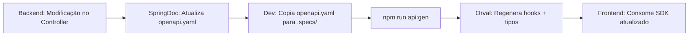

<div align="center">

# 🖥️ Portfolio Frontend

**Landing page e painel administrativo do portfólio de engenharia de software.**  
Construída com TanStack Start (SSR), geração automática de SDK via OpenAPI e componentes acessíveis com Radix UI + Tailwind CSS v4.

[](https://react.dev/)
[](https://www.typescriptlang.org/)
[](https://tanstack.com/start)
[](https://tailwindcss.com/)
[](https://vitejs.dev/)

</div>

---

## ✨ Visão Geral do Produto

Este repositório é o **frontend** do sistema de portfólio pessoal, dividido em duas experiências de usuário distintas:

- **🌐 Landing Page Pública:** Exibe o perfil profissional e os projetos desenvolvidos, consumindo os endpoints públicos da API do backend.
- **🔐 Painel Administrativo (CMS):** Interface de gerenciamento protegida por autenticação, onde projetos, tecnologias e o perfil são cadastrados e mantidos sem necessidade de alterar código-fonte.

A comunicação com a API é **100% typesafe**: o contrato OpenAPI do backend é consumido pelo **Orval** para gerar automaticamente todos os hooks React Query, tipos TypeScript e clientes Axios — eliminando discrepâncias manuais entre frontend e backend.

---

## 🏛️ Arquitetura

O projeto adota uma **arquitetura baseada em features** (Feature-Sliced Design), complementada pela estrutura de roteamento baseada em arquivos do TanStack Router.

```
src/
│
├── routes/                     # Roteamento baseado em arquivos (TanStack Router)
│   ├── __root.tsx               # Layout raiz, providers globais
│   ├── index.tsx                # Landing page pública (/)
│   ├── projects.$slug.tsx       # Página de detalhe de projeto
│   ├── login.tsx                # Tela de login (/login)
│   ├── admin.index.tsx          # Dashboard administrativo (/admin)
│   ├── admin.profile.tsx        # Gestão do perfil (/admin/profile)
│   ├── admin.projects.new.tsx   # Criar projeto (/admin/projects/new)
│   ├── admin.projects.$id.edit.tsx  # Editar projeto
│   └── admin.settings.tsx       # Configurações (/admin/settings)
│
├── features/                   # Módulos de domínio isolados
│   ├── portfolio/               # Componentes e tipos da landing page
│   ├── admin/                   # Componentes do painel administrativo
│   └── auth/                    # Lógica de autenticação
│
├── shared/
│   └── api/
│       ├── generated/           # 🤖 SDK auto-gerado pelo Orval (não editar!)
│       └── model/               # 🤖 Tipos TypeScript auto-gerados pelo Orval
│
├── components/                  # Componentes de UI reutilizáveis (shadcn/ui)
├── hooks/                       # Custom hooks globais
├── lib/                         # Utilitários e helpers
└── styles.css                   # Design system global (Tailwind v4)
```

### Fluxo de dados (API-First)

```
Backend gera openapi.yaml
     ↓
.specs/openapi.yaml  (contrato compartilhado)
     ↓
npm run api:gen  (Orval processa o YAML)
     ↓
src/shared/api/generated/  (hooks React Query + axios typesafe)
     ↓
Components consomem os hooks → UI renderizada com dados reais
```

---

## 🚀 Stack Tecnológica

| Categoria | Tecnologia | Versão |
|---|---|---|
| **Framework UI** | React | 19.x |
| **Linguagem** | TypeScript | 5.8.x |
| **Framework Full-Stack** | TanStack Start (SSR + SSG) | 1.x |
| **Roteamento** | TanStack Router (file-based) | 1.x |
| **Estado de Servidor** | TanStack Query (React Query) | 5.x |
| **HTTP Client** | Axios | 1.18.x |
| **Geração de SDK** | Orval (OpenAPI → React Query + Axios) | 8.x |
| **Estilização** | Tailwind CSS | 4.x |
| **Componentes** | Radix UI + shadcn/ui | — |
| **Validação de Forms** | React Hook Form + Zod | — |
| **Build Tool** | Vite | 8.x |
| **Linting / Formatting** | ESLint + Prettier | — |

---

## ⚙️ Como Executar Localmente

### Pré-requisitos

- **Node.js** 20+ instalado
- **Bun** ou **npm** disponível no PATH
- **Backend** em execução em `http://localhost:8080` (veja o [repositório do backend](https://github.com/mtstechnologies/landingpage-backend))

### 1. Instalar dependências

```bash
npm install
# ou com bun
bun install
```

### 2. Gerar o SDK da API (obrigatório na primeira vez)

Certifique-se de que o arquivo `.specs/openapi.yaml` está atualizado com o contrato mais recente do backend e então execute:

```bash
npm run api:gen
```

Isso irá gerar automaticamente os arquivos em `src/shared/api/generated/` e `src/shared/api/model/`. **Nunca edite esses arquivos manualmente.**

### 3. Iniciar o servidor de desenvolvimento

```bash
npm run dev
```

A aplicação estará disponível em: **`http://localhost:3000`**

---

## 📜 Scripts Disponíveis

| Comando | Descrição |
|---|---|
| `npm run dev` | Inicia o servidor de desenvolvimento com HMR |
| `npm run build` | Gera o bundle de produção |
| `npm run build:dev` | Gera o bundle em modo de desenvolvimento |
| `npm run preview` | Serve o build de produção localmente |
| `npm run api:gen` | Gera o SDK typesafe a partir do OpenAPI spec |
| `npm run lint` | Executa o ESLint em todos os arquivos |
| `npm run format` | Formata o código com Prettier |

---

## 🤖 Ciclo de Vida do Contrato (API-First)

Este projeto adota uma abordagem **API-First** rigorosa. O fluxo de atualização do SDK deve ser seguido sempre que o backend introduzir mudanças na sua API:



> **Configuração do Orval (`orval.config.ts`):**
> - **Entrada:** `.specs/openapi.yaml`  
> - **Saída:** `src/shared/api/generated/` (modo `tags-split`)
> - **Cliente:** `react-query` com `axios` como HTTP client
> - **Schemas:** `src/shared/api/model/`

---

## 🗂️ Estrutura de Rotas

| Rota | Componente | Acesso | Descrição |
|---|---|---|---|
| `/` | `index.tsx` | Público | Landing page com perfil e projetos |
| `/projects/:slug` | `projects.$slug.tsx` | Público | Detalhe de um projeto específico |
| `/login` | `login.tsx` | Público | Autenticação para o painel administrativo |
| `/admin` | `admin.index.tsx` | 🔐 Protegido | Dashboard do CMS |
| `/admin/profile` | `admin.profile.tsx` | 🔐 Protegido | Gestão do perfil profissional |
| `/admin/projects/new` | `admin.projects.new.tsx` | 🔐 Protegido | Criar novo projeto |
| `/admin/projects/:id/edit` | `admin.projects.$id.edit.tsx` | 🔐 Protegido | Editar projeto existente |
| `/admin/settings` | `admin.settings.tsx` | 🔐 Protegido | Configurações do sistema |

---

## 🎨 Design System

O projeto utiliza **Tailwind CSS v4** como base do design system, com componentes acessíveis do **shadcn/ui** (construídos sobre Radix UI Primitives).

**Componentes principais disponíveis:**

- Formulários com validação: `Form`, `Input`, `Select`, `Checkbox`, `Switch`
- Layout e navegação: `Dialog`, `NavigationMenu`, `Popover`, `Drawer (vaul)`
- Feedback: `Toast (Sonner)`, `Progress`, `Skeleton`
- Dados: `Table`, `Recharts` (gráficos), `DataPicker (react-day-picker)`
- Carousels com `Embla Carousel`

Todos os ícones são providos pelo **Lucide React**.

---

## 🔐 Autenticação

O painel administrativo consome os endpoints `/api/v1/admin/portfolio/**` do backend, que são protegidos por **HTTP Basic Auth** com a autoridade `PORTFOLIO_ESCRITA`.

As credenciais são gerenciadas pelo frontend na feature `auth/` e enviadas em cada requisição via **Axios** no header `Authorization`.

**Requisitos especiais para operações `POST` (criação):**

O backend exige o header `Idempotency-Key` em todas as requisições de criação. O SDK gerado pelo Orval abstrai isso, mas garanta que o cliente Axios esteja configurado para gerar e enviar esse header automaticamente.

---

## 🧩 Padrões e Convenções

| Prática | Detalhe |
|---|---|
| **Tipos** | 100% tipados via TypeScript. Nunca use `any`. |
| **Geração de código** | Nunca edite arquivos em `src/shared/api/generated/` ou `src/shared/api/model/`. |
| **Formulários** | Use sempre `react-hook-form` + `zod` para validação. |
| **Requisições** | Use sempre os hooks gerados pelo Orval (não instancie Axios diretamente nas features). |
| **Roteamento** | Novas páginas = novo arquivo em `src/routes/`. Não crie routers manuais. |
| **Estilização** | Prefira classes utilitárias do Tailwind. Use `cn()` de `lib/utils.ts` para classes condicionais. |

---

## 🔗 Repositórios Relacionados

| Repositório | Descrição |
|---|---|
| [landingpage-backend](https://github.com/mtstechnologies/landingpage-backend) | API Spring Boot que alimenta este frontend |

---

## 📬 Contato

**Michael Trindade da Silva**  
Engenheiro de Software · Pesquisador de Mestrado (UFRGS)  
📧 [michaeltrindadedasilva@gmail.com](mailto:michaeltrindadedasilva@gmail.com)  
🔗 [LinkedIn](https://www.linkedin.com/in/michael-trindade/) · [GitHub](https://github.com/mtstechnologies)